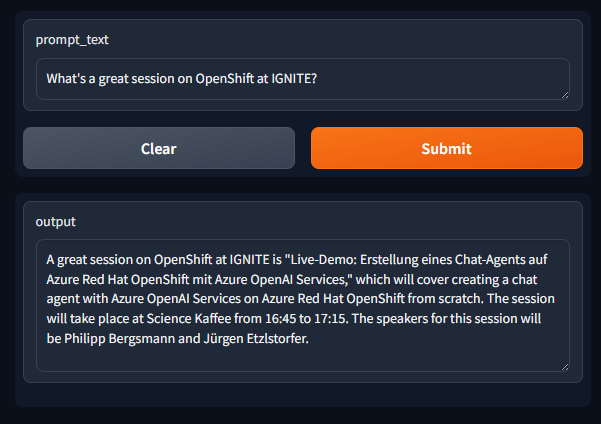

# Demo for Microsoft IGNITE 2024

🚧 still under construction... 🚧 

## Setup

### Azure OpenAI Models

Tested with `gpt-35-turbo` and `text-embedding-ada-002`.

Name of models in the code (can be changed, of course):
- `gpt-35-turbo`
- `text-embedding-3-small`

### Environment variables

```
AZURE_OPENAI_API_KEY=
AZURE_OPENAI_ENDPOINT=
```

### Demo run


